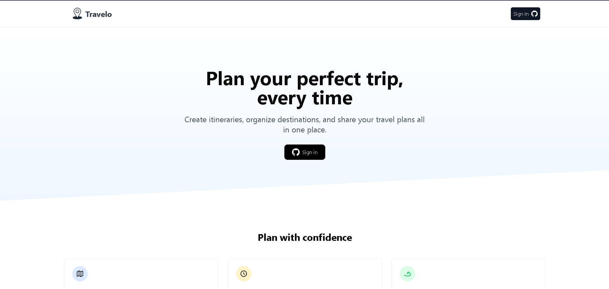
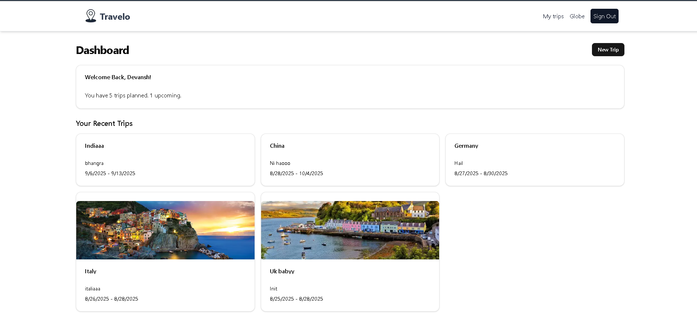
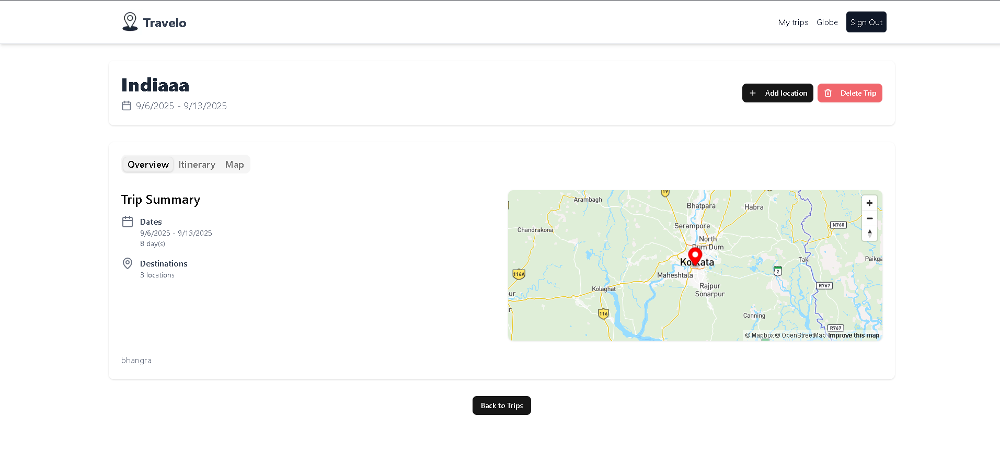
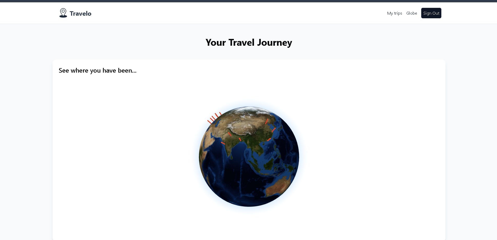

# Travelo – Travel Itinerary Planner

A travel itinerary planner built with **Next.js, TypeScript, and TailwindCSS**.  
Features **interactive maps**, **drag-and-drop scheduling**, and day-by-day trip organization.  
Deployed on **Vercel**.  

🔗 Live Demo → [Travelo](https://travel-weld-three.vercel.app/)

---

## 🛠 Tech Stack
- **Frontend:** Next.js, TypeScript, TailwindCSS, shadcn/ui  
- **Maps & Geolocation:** (Leaflet.js / Mapbox – update based on what you actually used)  
- **State Management:** React Hooks  
- **Deployment:** Vercel  

---

## 📁 Project Structure
Travelo/
├─ app/ # Next.js app directory

├─ components/ # Reusable UI components

├─ lib/ # Utility functions

├─ prisma/ # Prisma schema & migrations

├─ public/ # Static assets

├─ screenshots/ # Project screenshots

└─ README.md

---

## ⚙️ Setup

### 1) Clone the repository
``bash
git clone https://github.com/devanshjhaa/travel.git
cd travel

Install dependencies
npm install

Configure environment variables

.env.local

NEXT_PUBLIC_MAP_API_KEY=your_api_key   # if required

Run locally
npm run dev

Now open → http://localhost:3000
----
🚀 Features

Create and organize day-by-day itineraries

Interactive maps for trip visualization

Drag-and-drop scheduling for easy itinerary management

Clean and responsive UI with TailwindCSS

## 📸 Screenshots

### Dashboard

### My Trips

### Itinerary Planner

### Globe View

